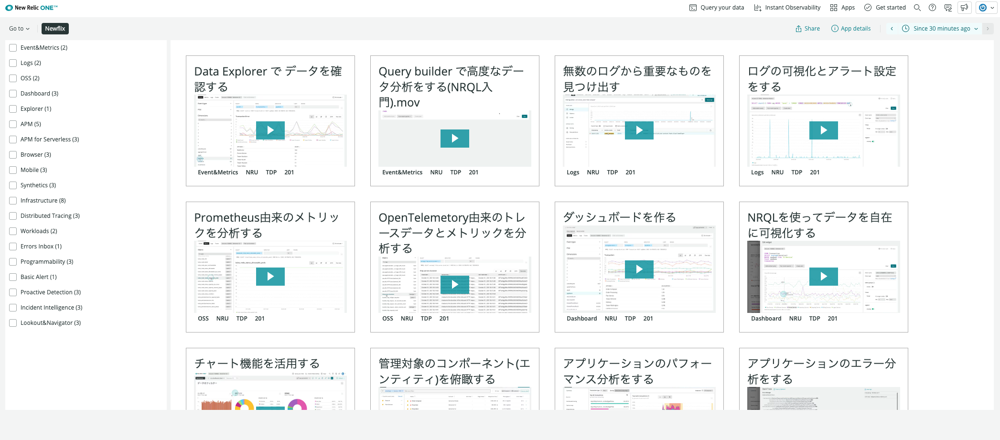
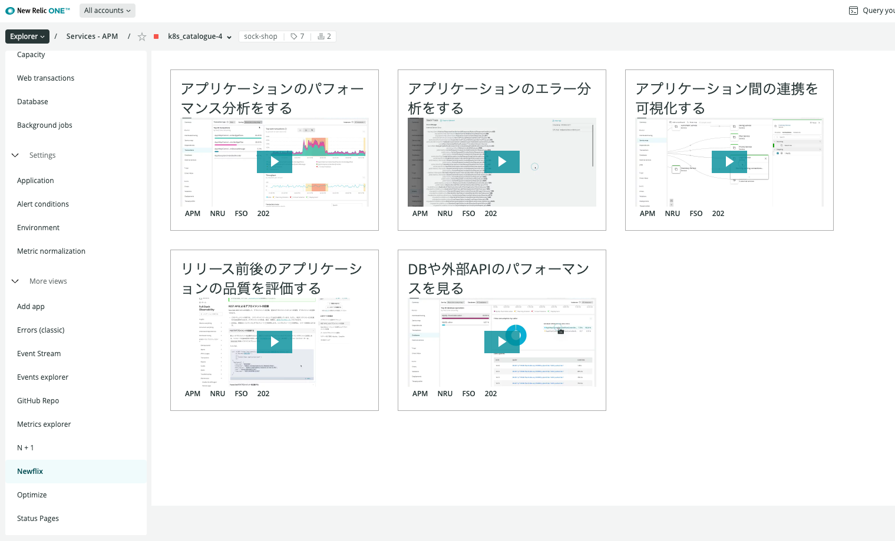

# New Relic KK Learning videos
You can see New Relic use case with this application.  
Try to see the video at first when you don't know how to use the NR1 UI for your work.  
You can access to the application from Apps or side menu of APM, Browser and Mobile apps in NR1.   

## Quick start

You can publish this application with Github Actions.

1. Please fork this repository

2. Please create / copy USER key. You can create a key [here](https://one.newrelic.com/launcher/api-keys-ui.api-keys-launcher) and The USER key sould be generated for master acccount.

3. Please create "Github Repository secret (Settings > Secrets > New repository secret)" Name=NR_USER_KEY Value=${YOUR USER KEY}

4. Only first time, Please execute "Publish New Relic Application" action. This task every time failed but you can ignore failure.

## Sample images
Use application from New Relic Apps


Use application from APM UI



## Getting started

Run the following scripts:

```
npm install
npm start
```

Visit https://one.newrelic.com/?nerdpacks=local and :sparkles:

## Creating new artifacts

If you want to create new artifacts run the following command:

```
nr1 create
```

> Example: `nr1 create --type nerdlet --name my-nerdlet`.
